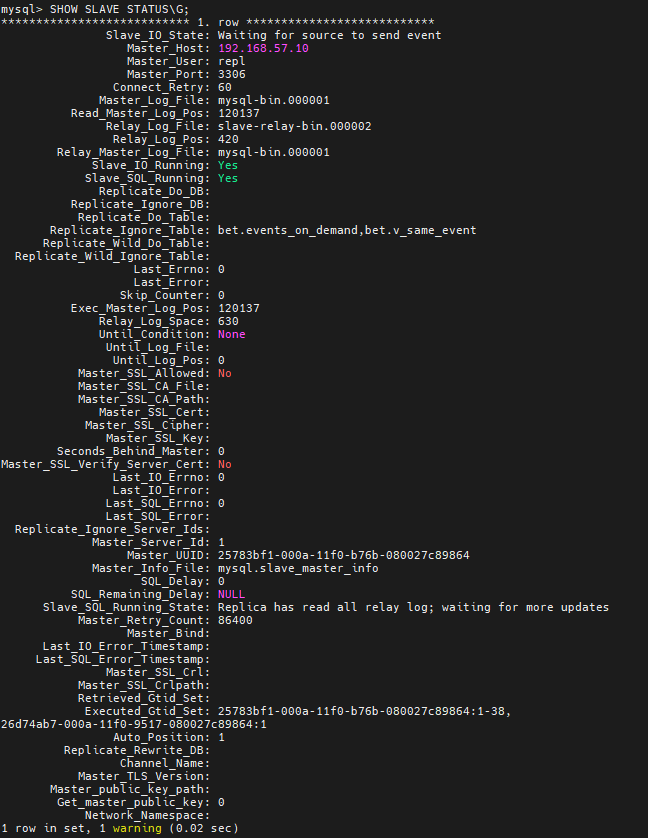

# Vagrant-стенд c репликацией mysql


### Цель домашнего задания
Развернуть базу на мастере и настроить так, чтобы реплицировались таблицы:     

| bookmaker          |
| competition        |
| market             |
| odds               |
| outcome            |     

Настроить GTID репликацию

Варианты которые принимаются к сдаче:    
1. Рабочий вагрантафайл     
2. Скриншоты или логи SHOW TABLES    
3. Конфиги*    
*пример в логе изменения строки и появления строки на реплике*     
    
Формат сдачи ДЗ - vagrant + ansible      

## Выполнение    
### 1.  С помощью vagrant развернул машину:    

| Имя          | IP-адрес       |  OS   |
|-------------|---------------|-----------|
| master  | 192.168.57.10  |  bento/ubuntu-22.04  |  
| slave  | 192.168.57.20  |  bento/ubuntu-22.04  |


### 2. Создал ansible playbook и роли    
Запустил playbook    
```shell
root@ansible:/home/vagrant/ansible# ansible-playbook mysql.yml

PLAY [all] ****************************************************************************************************

TASK [Gathering Facts] ****************************************************************************************
ok: [192.168.57.10]
ok: [192.168.57.20]
...
PLAY RECAP ************************************************************************************************************************************************************************************
192.168.57.10              : ok=20   changed=18   unreachable=0    failed=0    skipped=0    rescued=0    ignored=0
192.168.57.20              : ok=19   changed=16   unreachable=0    failed=0    skipped=0    rescued=0    ignored=0
```   
Playbook отработал без ошибок    

### 3. Далее проверяю результат правильной раскатки playbook   

Перехожу на slave и проверяю репликацию     
```shell
root@slave:~# mysql
Welcome to the MySQL monitor.  Commands end with ; or \g.
Your MySQL connection id is 20
Server version: 8.0.41-32 Percona Server (GPL), Release '32', Revision 'b8e378ec'

Copyright (c) 2009-2025 Percona LLC and/or its affiliates
Copyright (c) 2000, 2025, Oracle and/or its affiliates.

Oracle is a registered trademark of Oracle Corporation and/or its
affiliates. Other names may be trademarks of their respective
owners.

Type 'help;' or '\h' for help. Type '\c' to clear the current input statement.

mysql> SHOW SLAVE STATUS\G;
```    

     

Репликация запущена     

#### 3.1. Далее на master создаю запись test в таблице bet, чтобы убедиться что репликация работает и данны передаются на slave     
*на master*     
Проверяю включен ли режим GTID     
```shell 
root@master:~# mysql
Welcome to the MySQL monitor.  Commands end with ; or \g.
Your MySQL connection id is 14
Server version: 8.0.41-32 Percona Server (GPL), Release '32', Revision 'b8e378ec'

Copyright (c) 2009-2025 Percona LLC and/or its affiliates
Copyright (c) 2000, 2025, Oracle and/or its affiliates.

Oracle is a registered trademark of Oracle Corporation and/or its
affiliates. Other names may be trademarks of their respective
owners.

Type 'help;' or '\h' for help. Type '\c' to clear the current input statement.

mysql> SHOW VARIABLES LIKE 'gtid_mode';
+---------------+-------+
| Variable_name | Value |
+---------------+-------+
| gtid_mode     | ON    |
+---------------+-------+
1 row in set (0.03 sec)
```     
Смотрю базы и таблицы     
```shell
mysql> SHOW DATABASES;
+--------------------+
| Database           |
+--------------------+
| bet                |
| information_schema |
| mysql              |
| performance_schema |
| sys                |
+--------------------+
5 rows in set (0.00 sec)

mysql> USE bet;
Reading table information for completion of table and column names
You can turn off this feature to get a quicker startup with -A

Database changed
mysql> SHOW TABLES;
+------------------+
| Tables_in_bet    |
+------------------+
| bookmaker        |
| competition      |
| events_on_demand |
| market           |
| odds             |
| outcome          |
| v_same_event     |
+------------------+
7 rows in set (0.00 sec)
```    
перехожу в таблицу bookmaker     
```shell
mysql>  SELECT * FROM bookmaker;
+----+----------------+
| id | bookmaker_name |
+----+----------------+
|  4 | betway         |
|  5 | bwin           |
|  6 | ladbrokes      |
|  3 | unibet         |
+----+----------------+
4 rows in set (0.01 sec)
```     
Добавляю запись test     
```shell
mysql> INSERT INTO bookmaker (id,bookmaker_name) VALUES(1,'test');
Query OK, 1 row affected (0.41 sec)

mysql>  SELECT * FROM bookmaker;
+----+----------------+
| id | bookmaker_name |
+----+----------------+
|  4 | betway         |
|  5 | bwin           |
|  6 | ladbrokes      |
|  1 | test           |
|  3 | unibet         |
+----+----------------+
5 rows in set (0.00 sec)
```     
Запись появилась      

*на slave*    
```shell
root@slave:~# mysql
Welcome to the MySQL monitor.  Commands end with ; or \g.
Your MySQL connection id is 21
Server version: 8.0.41-32 Percona Server (GPL), Release '32', Revision 'b8e378ec'

Copyright (c) 2009-2025 Percona LLC and/or its affiliates
Copyright (c) 2000, 2025, Oracle and/or its affiliates.

Oracle is a registered trademark of Oracle Corporation and/or its
affiliates. Other names may be trademarks of their respective
owners.

Type 'help;' or '\h' for help. Type '\c' to clear the current input statement.

mysql> SHOW VARIABLES LIKE 'gtid_mode';
+---------------+-------+
| Variable_name | Value |
+---------------+-------+
| gtid_mode     | ON    |
+---------------+-------+
1 row in set (0.05 sec)

mysql> SHOW DATABASES;
+--------------------+
| Database           |
+--------------------+
| bet                |
| information_schema |
| mysql              |
| performance_schema |
| sys                |
+--------------------+
5 rows in set (0.01 sec)

mysql>  USE bet; SELECT * FROM bookmaker;
Database changed
+----+----------------+
| id | bookmaker_name |
+----+----------------+
|  4 | betway         |
|  5 | bwin           |
|  6 | ladbrokes      |
|  1 | test           |
|  3 | unibet         |
+----+----------------+
5 rows in set (0.00 sec)
```
Из вывода команды "USE bet; SELECT * FROM bookmaker;" вижу что созданная запись на master пролилась на slave     
Репликация работает

### 4. создал playbook проверки репликации
Запустил playbook test_replication.yml    
```shell
root@ansible:/home/vagrant/ansible# ansible-playbook test_replication.yml

PLAY [Test MySQL replication] *****************************************************************************************************************************************************************

TASK [Gathering Facts] ************************************************************************************************************************************************************************
ok: [192.168.57.10]
ok: [192.168.57.20]

TASK [Debug root_password] ********************************************************************************************************************************************************************
ok: [192.168.57.10] => {
    "msg": "root_password is Qazwsx123!"
}
ok: [192.168.57.20] => {
    "msg": "root_password is Qazwsx123!"
}

TASK [Insert test data on master] *************************************************************************************************************************************************************
skipping: [192.168.57.20]
changed: [192.168.57.10]

TASK [Check replication on slave] *************************************************************************************************************************************************************
skipping: [192.168.57.10]
changed: [192.168.57.20]

PLAY RECAP ************************************************************************************************************************************************************************************
192.168.57.10              : ok=3    changed=1    unreachable=0    failed=0    skipped=1    rescued=0    ignored=0
192.168.57.20              : ok=3    changed=1    unreachable=0    failed=0    skipped=1    rescued=0    ignored=0
```    
Playbook отработал без ошибок
____________________________________________________________________     
end


